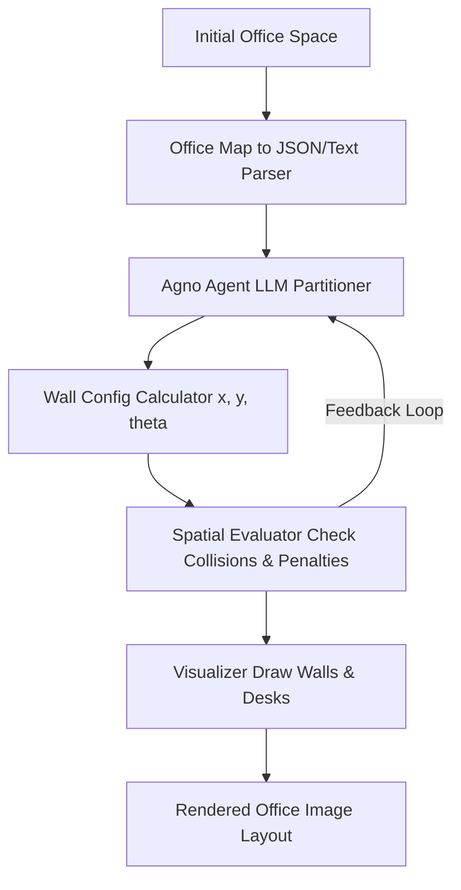

# Agentic Spatial Partitioner (llm-as-office-partitioner)

## Overview
An automated spatial design and layout optimization engine that uses AI agents and computational geometry to solve office partitioning. It leverages LLMs to simulate layout reasoning and automatically designs wall configurations while scoring desk/object placement to minimize collisions and noise.

---

## Technical Architecture



### 1. Agentic Spatial Design (Agno/Phidata)
*   **Structured LLM Reasoning:** Implements a step-by-step thinking loop (`agno_agent.py`) that utilizes Large Language Models to suggest partition placements based on office density and layout requirements.
*   **Textual & JSON Feeds:** Translates physical layouts to textual descriptions and structured JSON tokens, allowing context engineering to work effectively with LLM input windows.
*   **Iterative Design Loops:** Feedback signals (`llm_feedback.py`) analyze placement scores and prompt the LLM to refine wall coordinates dynamically.

### 2. Geometry & Collision Scoring
*   **Collision Detection Matrix:** Computes intersection and proximity penalties (`check_collisions.py`) to prevent walls from intersecting with structural columns, doors, or existing furniture.
*   **Acoustic & Privacy Penalties:** Evaluates spatial noise containment (`penalty_score.py`) depending on room divisions.
*   **Layout Optimizer:** A search heuristic to tweak wall layout configurations.

### 3. Rendering Pipeline
*   **Custom Drawing Canvas:** Draws desk objects, persons, windows, doors, and walls (`draw.py`) using Python imaging libraries to provide immediate multi-modal visuals of current drafts.

---

## File Structure
```
src/
├── llm/
│   ├── agno_agent.py         # Main LLM agent loop using Agno (Phidata)
│   ├── llm_feedback.py       # Iterative layout evaluation and prompt feedback
│   └── llm_visualization.py  # Visual rendering bridge for agent prompts
├── office_score/
│   ├── penalty_score.py      # Spatial scoring and noise analysis
│   ├── check_collisions.py   # Vector intersection checks for desks, walls, doors
│   └── optimisation.py       # Algorithmic layout tweaks
├── draw_python/
│   ├── draw_walls.py         # Wall placement renderer
│   ├── draw_desk.py          # Desk alignment renderer
│   └── draw.py               # Main image generation manager
└── office_description/
    ├── office_to_json.py     # Parser converting office dimensions to JSON schema
    └── office_to_text.py     # Translator creating text prompts for LLMs
```

---

## Quick Start

### Installation
1. Install system dependencies (Python 3.10+).
2. Install Python packages:
   ```bash
   pip install -r requirements.txt
   ```

### Execution
Run the visual agent optimizer loop:
```bash
python -m src.llm.agno_agent
```
